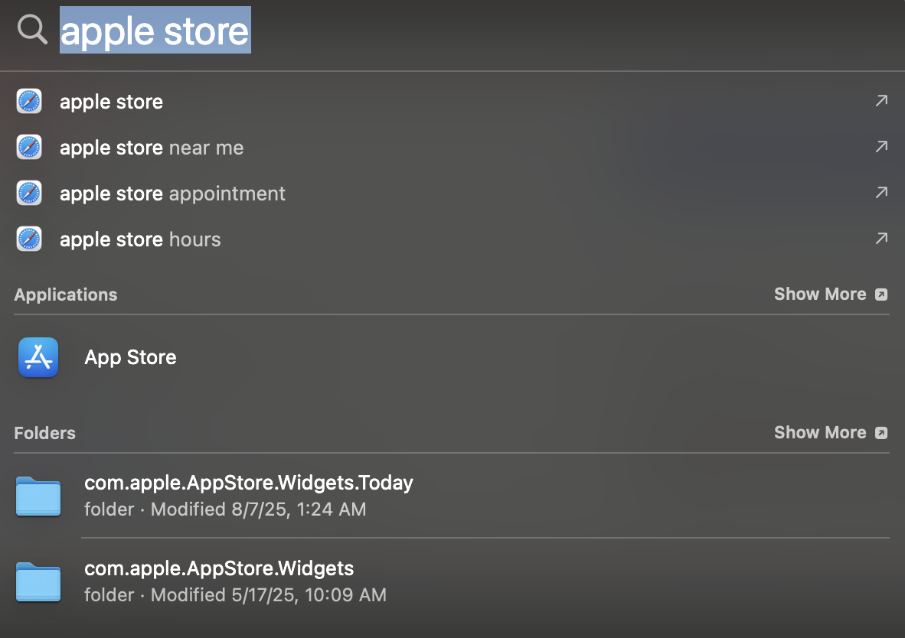

## C++ Helloworld Program for Mac Users


### Installing Visual Studio Code

- Install [Visual Studio Code]((https://code.visualstudio.com/download)) for mac users.

### Installing Xcode

- Go to the apple store by going to the search button on the top right of your desktop.



- Once in the apple store, type in Xcode. Install it.


- While it is installing a license agreement should appear, accept it.


- The following window should come up. Only check the ones I have checked marked and continue.


### Running your First C++ Program

- In the search tab on the top right click it and enter terminal
- You should see the following screen, click terminal program.


- After clicking you should see the following screen and program come up.


- Inside the terminal window type the following commands followed by the enter button.

```bash
mkdir CIS_5_Projects
mkdir CIS_5_Projects/Lab0
cd CIS_5_Projects/Lab0
touch main.cpp
```

- You should see the following output on your screen if done correctly.


- Leave the terminal minimized. Again go to search bar and open visual studio code.


- One visual studio code opens up, click on the on icon to the left that looks like two papers stacked on each other. You should see the following.


- Click on open folder. The folder you want to go to is the Lab0 folder. If you did the previous steps correctly, you should see the following.


- Once you click it you should the main.cpp to the left in visual studio code. Click it and type the following code in the file.

```c++
#include <iostream>

int main(int argc, char* argv[])
{

    std::cout << "Hello World";

    return 0;
}
```
- You should now have the following in visual studio code.


- Next at the top of you window, you should see the terminal tab, click and press new terminal. You visual studio code program should like this now.


- In the bottom window you will type the following command follwed by the enter button.

```bash
g++ main.cpp
```

- If done correctly you should see the following screen. There should be new file to the left called "a.out" and the terminal should like the one in the picture.


- Next in the terminal again, run the following command follwed by the enter button.

```bash
./a.out
```

- If done correctly you should see the following output in the terminal 


- Congragulations! You have ran your first c++ program!