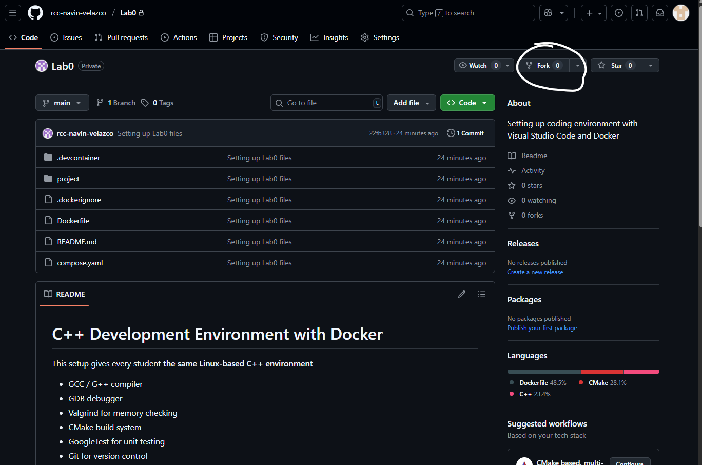
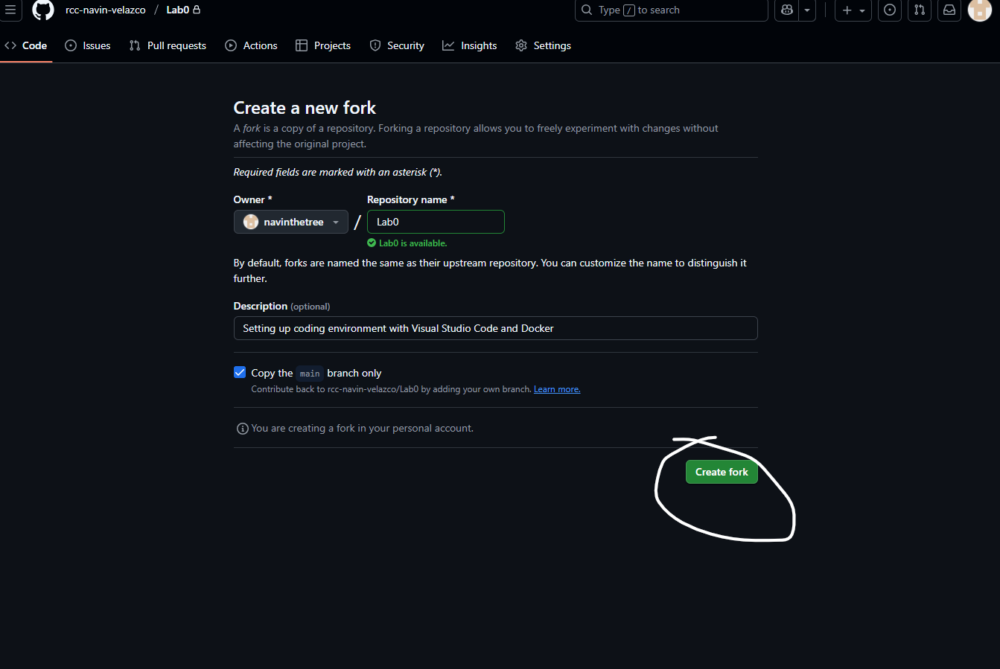
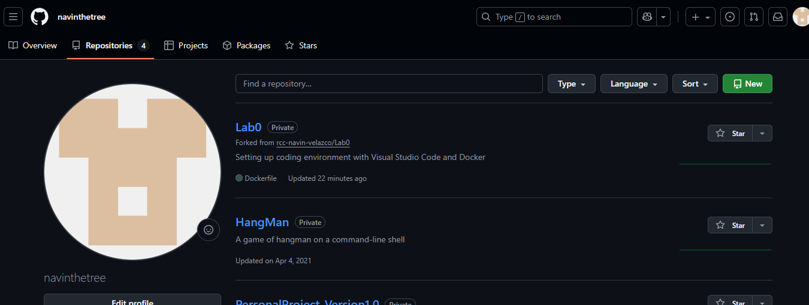
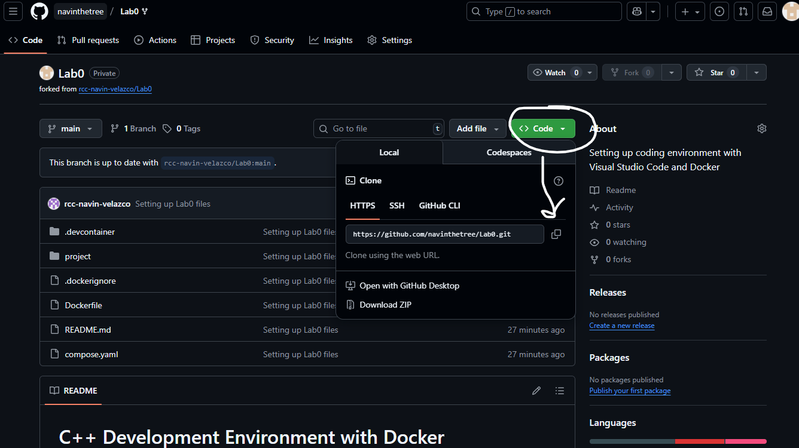

# C++ Development Environment with Docker


This setup gives every student **the same Linux-based C++ environment**
- GCC / G++ compiler
- GDB debugger
- Valgrind for memory checking
- CMake build system
- GoogleTest for unit testing
- Git for version control

It ensure that code behaves **exactly the same** on all machines (Windows, macOS, Linux).


---


## 1. Docker Desktop
- Install [Docker]((https://www.docker.com/get-started))


## 2. Visual Studio Code
- Install [VSCode]((https://code.visualstudio.com/download))

## 3. Git and GitHub
- Install [Git]((https://git-scm.com/downloads))
- Make a [Github Account]((https://github.com/signup?ref_cta=Sign+up&ref_loc=header+logged+out&ref_page=%2F&source=header-home))

## 4. Setting up Lab0
- Go to my repository page
- Fork the project Lab0


- Go to your repository page and you should have a copy of Lab0

- There should be Code button with an arrow pointing down. 
Click that arrow and copy the https url.

- Open up the Git CMD program and run the following commands
```bash
mkdir CIS_5_Labs
cd CIS_5_Labs
git clone [project-url-that-you-copied]
cd Lab0
```
Now you should have a copy of the project locally on your machine.

## 5. Opening VS Code with Docker
- Open up docker desktop
- Make sure you have docker account created so you are signed in.
- Confirm you have docker running and minimize the docker window
- Go back to your terminal.
- Open up VS Code and open up the Lab0 folder.
- You should see a prompt requesting to reopen in container. Press it
- Once VS Code opens successfully run the following commands 
```bash
cd build
cmake ..
make
./runtests
```
If you have done this correclty you should see 2/2 Test cases passing highlighted in green. Congragulations! You have ran your first program in C++! This project will be required for lab programming exercises and project as well!. 

There were alot details that I glanced over like what the docker,terminal programs are as well as google tests. Wednesday we will go over more closely what everything does. For today just focus on getting your IDE set up.

## 12. Summary

- Docker ensure every student has the same environment
- You can compile, debug, test, and check memory in one place.
- Code remains on your local machine, Docker just runs the tools.
- CMake and GoogleTest are preconfigured for painless testing.


