## C++ Helloworld Assignment for Windows Users


### Visual Studio Code
- Install [Visual Studio Code]((https://code.visualstudio.com/))
---
### Visual Studio
- Install [Visual Studio]((https://visualstudio.microsoft.com/downloads/))
- Download the community free version
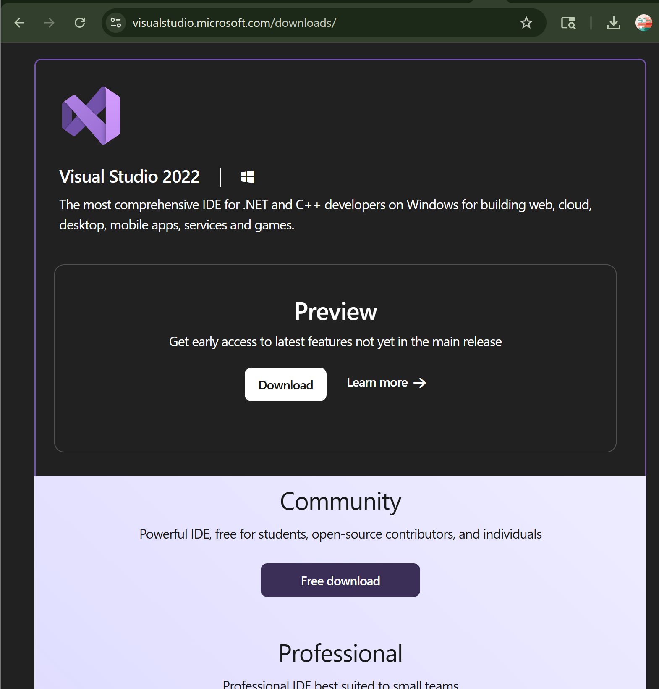
- You should get the following installing the visual studio installer
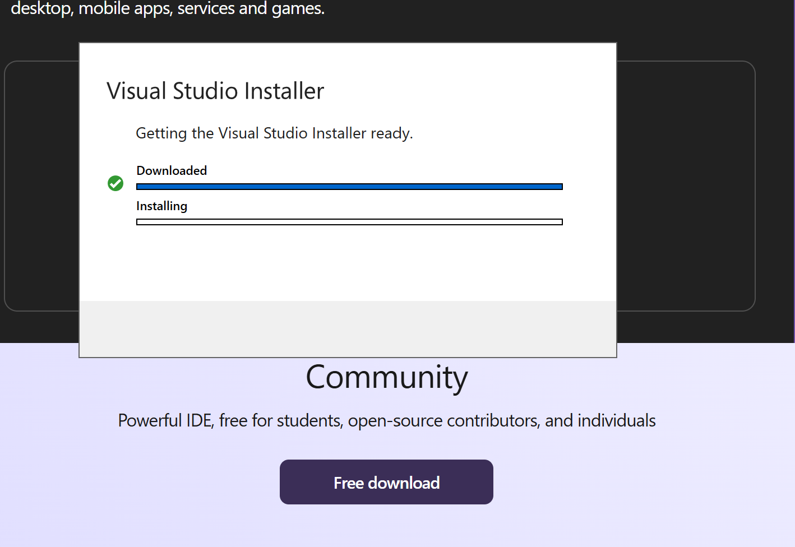
- Once the Visual Installer finishes executing you should see the following screen
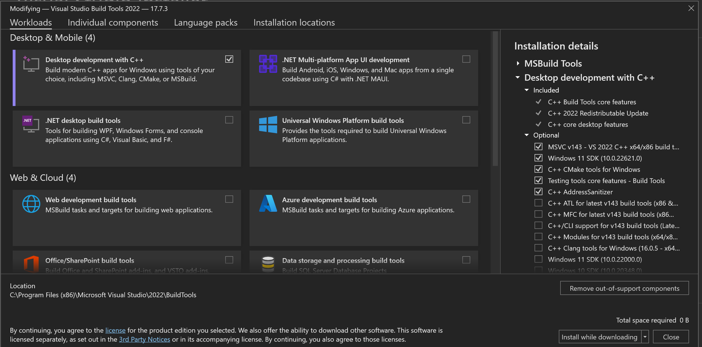
- You should be under the workloads section and scroll to where it says Desktop and mobile. There you should mark the box that says 

"Desktop Development with C++". 

Then click install.
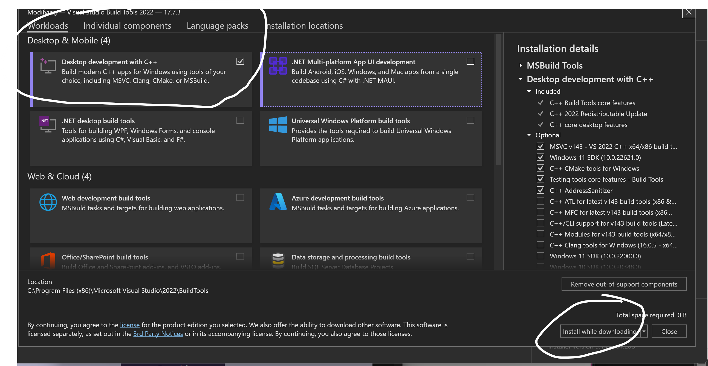.

- Once that finishes installing, the
Developer Command Prompt Program should be installed on your computer. Run it by clicking it

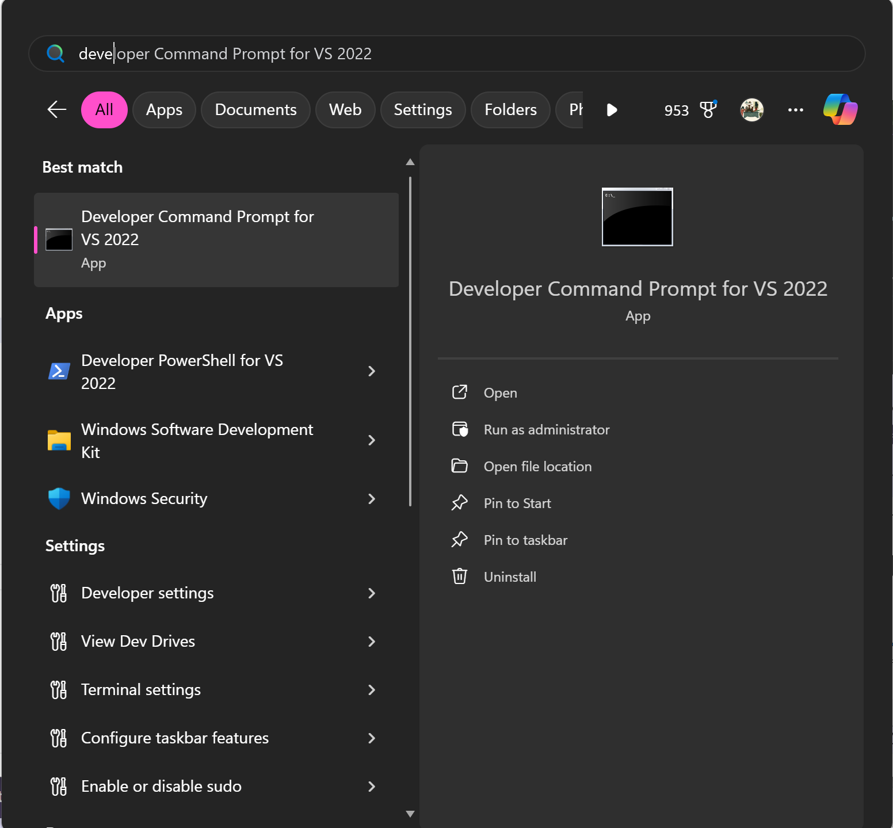

- You should then see the following program

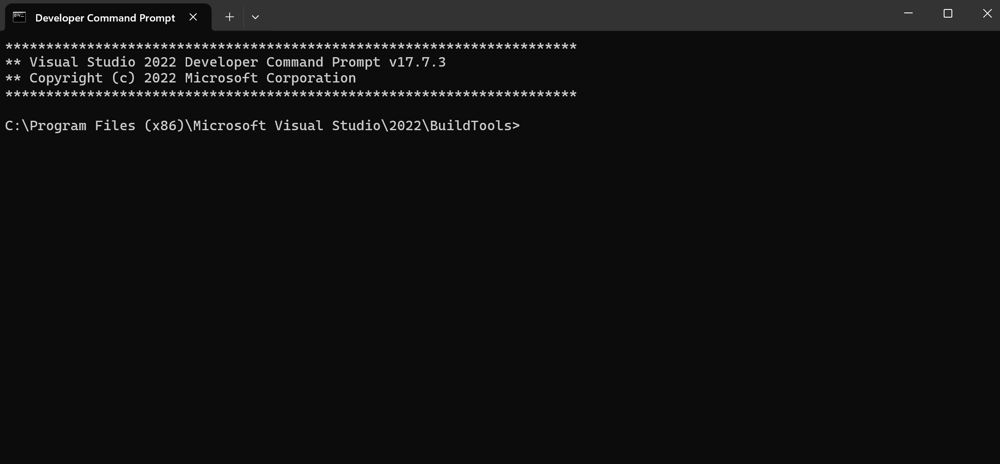

- Type the following commands followed by "enter" button.

```bash
cd /
mkdir Users/[user_name]/CIS_Projects
cd Users/[user_name]/CIS_Projects
mkdir Lab0
cd Lab0
echo. > main.cpp
code .
```

-If done successfully you should see the following screen

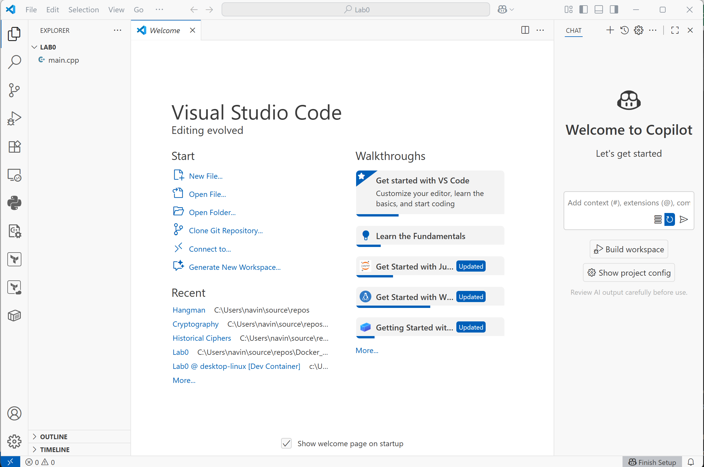

- Click on the main.cpp file and type the following code snippet in the file. Please no copy and paste.

```c++
#include <iostream>


int main(int argc, char** argv[])
{

    std::cout << "Hello World";

    return 0;
}
```
- You should now see this in visual studio code.
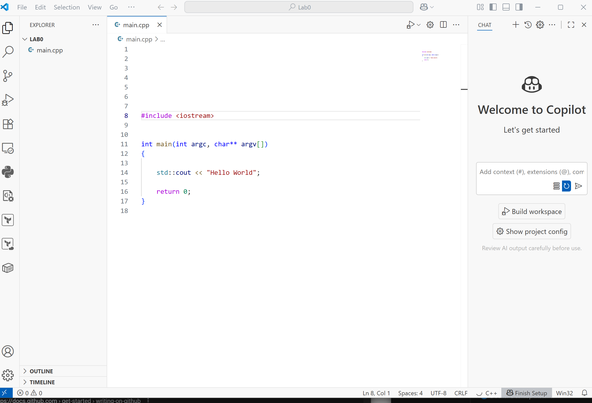

- On top left of VS Code, you should see the Terminal tab. Click it and press new terminal.

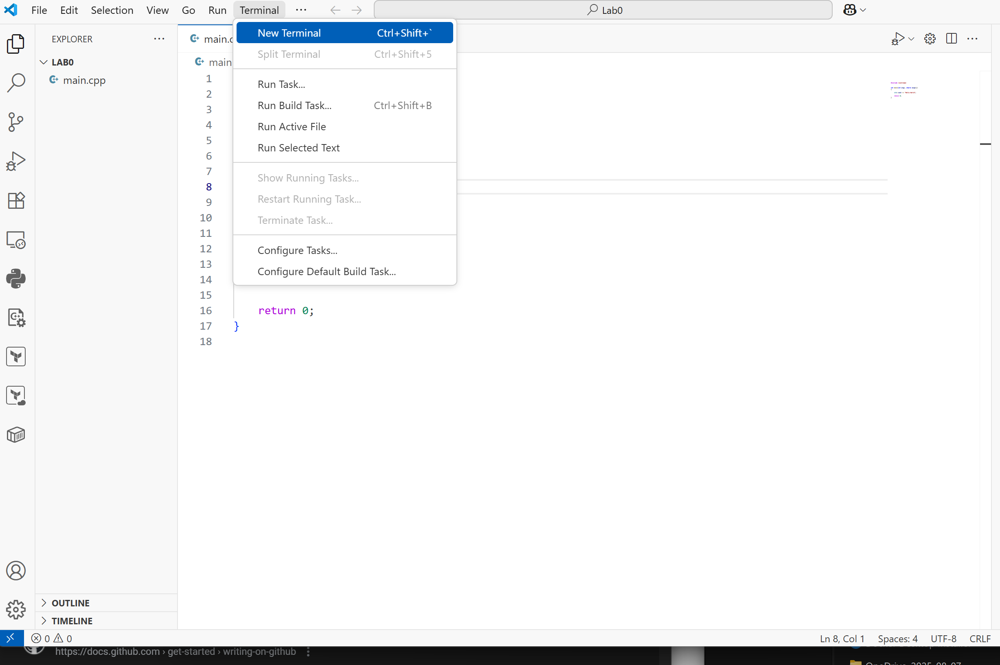
- Once you click you should see the following two tabs.
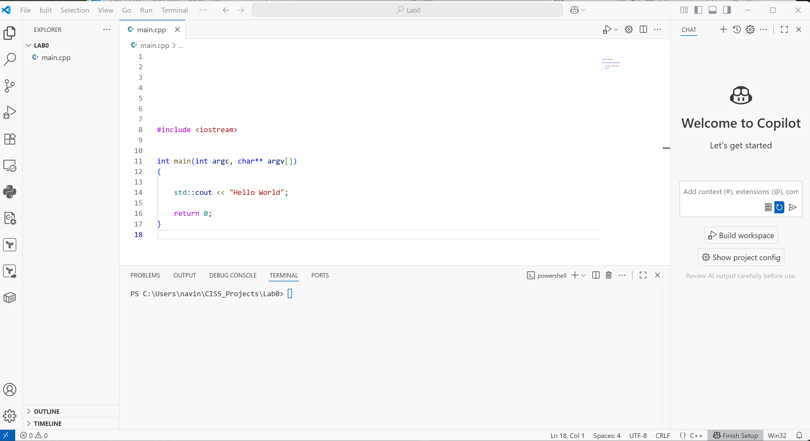

- Type the following in the terminal window and then press enter
```bash
cl main.cpp
```

- If successful you should see twp files in left hand side next to main.cpp called main.exe and main.obj.

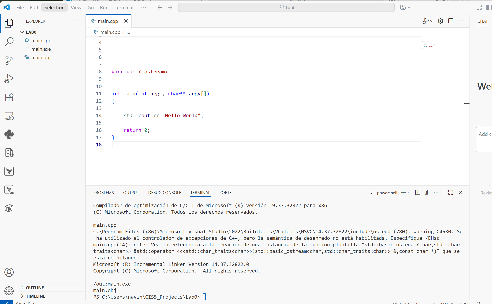

- You will then run the following in the terminal followed by the enter button.

```bash
./main.exe
```

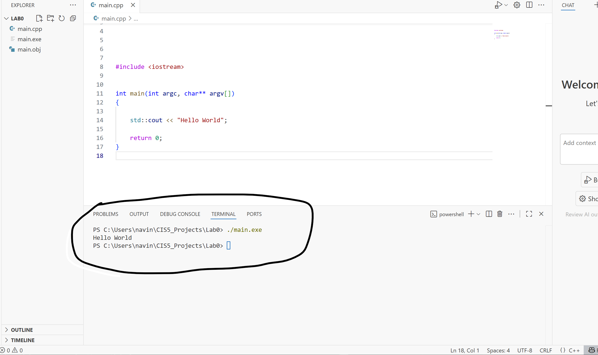

- You should then see Hello World outputted on the screen as shown above

- Congragulations! You have compiled and ran your first C++ program!! Happy happy!
